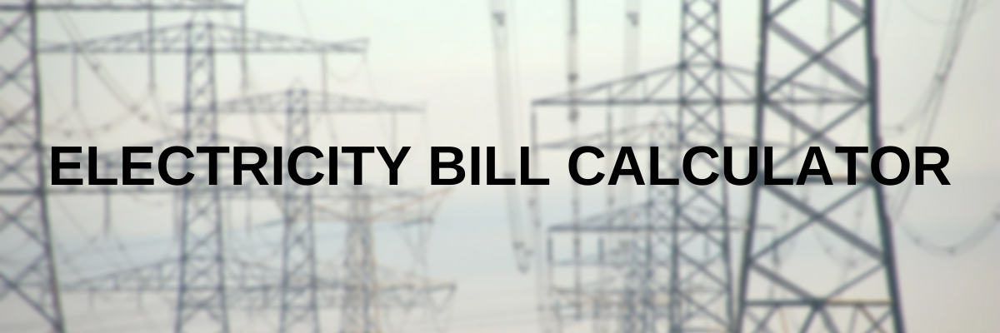

# PythonBasics
**This Repo contains some of the basic Python projects done by me**
<ul>
  <li>Electricity Bill Calculator (https://github.com/iravindu/PythonBasicProjects/blob/main/electricity.py)</li>
  <li>Factorial Finder</li>
  <li>Fibonacci Series Generator</li>
  <li>Number Reverser</li>
</ul>

## Electricity Bill Calculator

